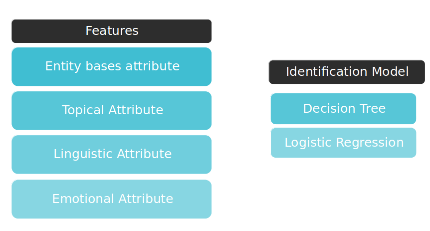
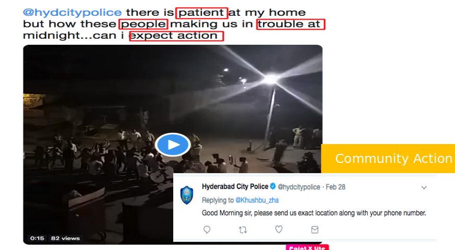
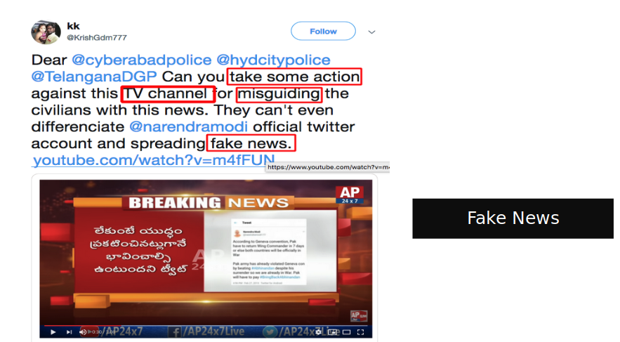
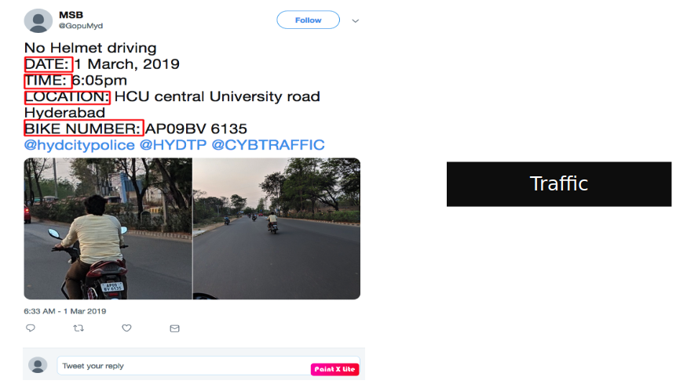
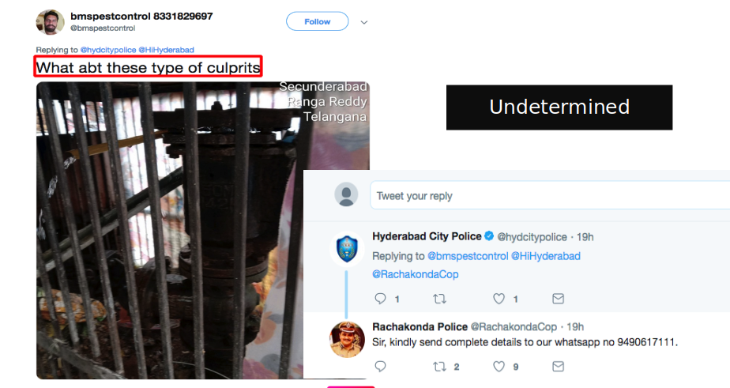
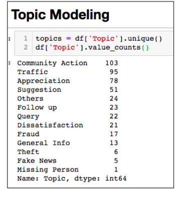
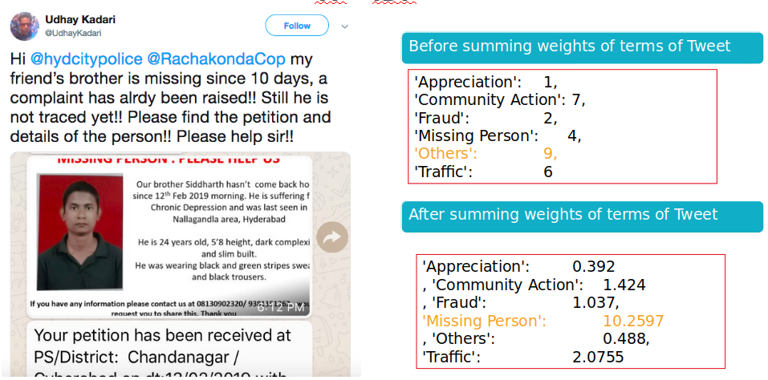
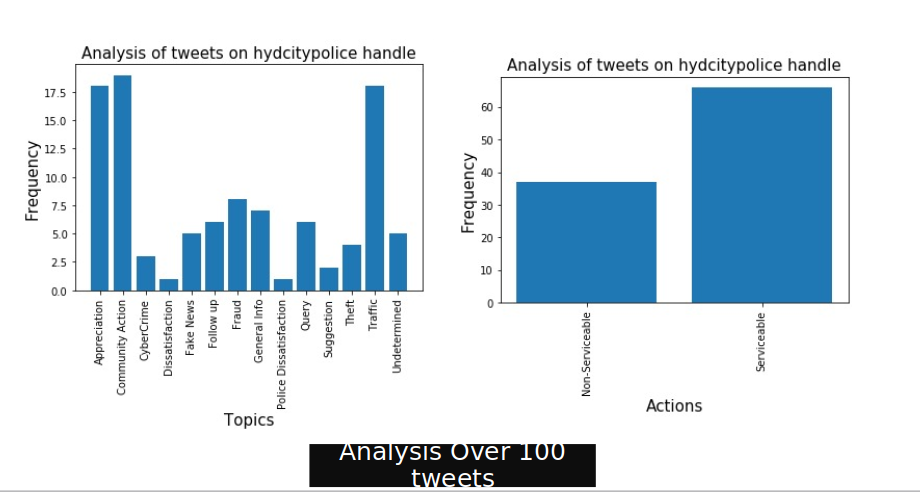
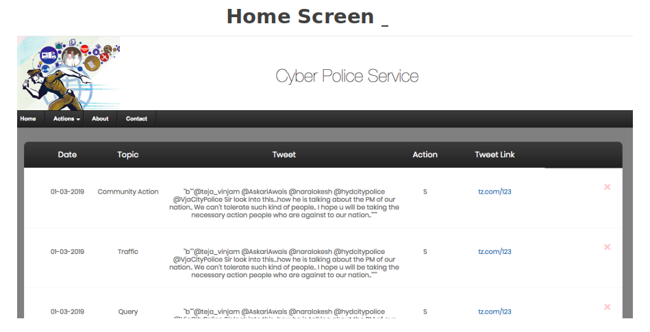

# Classification-of-Actionable-Tweets

<h2>Content</h2>
<ul>
  <li>Data Collection</li> 
  <li>ML Methodology</li>
  <li>Data Analysis</li>
  <li>Dashboard Layout</li>
 </ul>

<h3>Data Collection </h3>
<ul>
  <li>Tweets are collected tagged with particular police handle.</li>  
  <li>Tweepy api is used to get the tweets in python.</li>
</ul>

<h3>ML Methodology</h3>

<h3>ML Classification Sample</h3>
<h4>Community Action</h4>

<h4>Fake News</h4>

<h4>Fraud</h4>

<h4>Traffic</h4>

<h4>Undetermined</h4>

<h3>Primary Analysis</h3>
<h4>Topic Modelling</h4>

<h4>TF IDF Analysis on Post</h4>

<h4>Analysis</h4>

<h3>Dashboard Inteface</h3>

